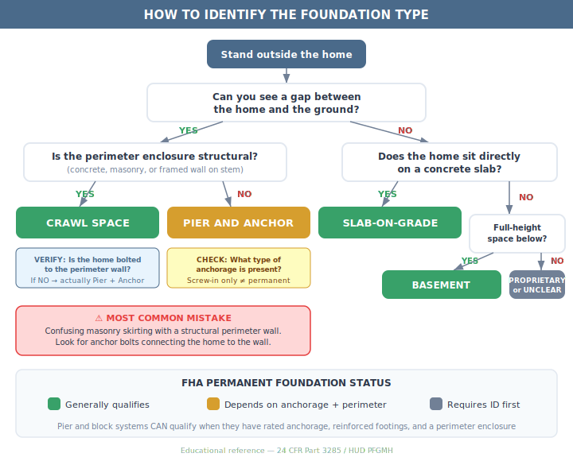
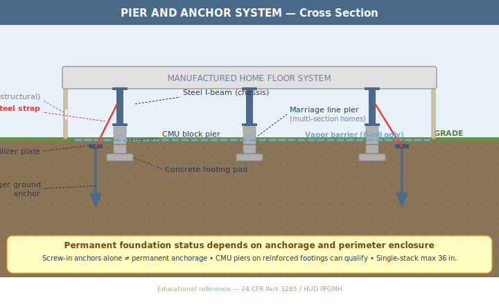
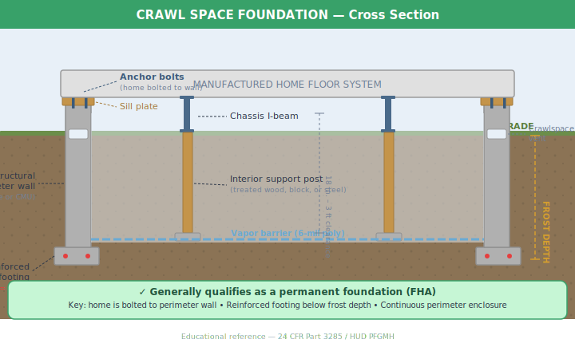
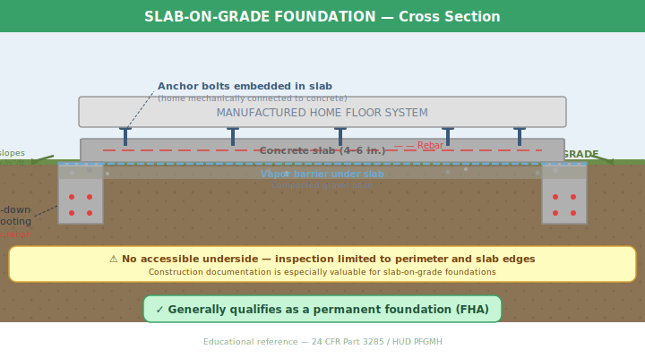
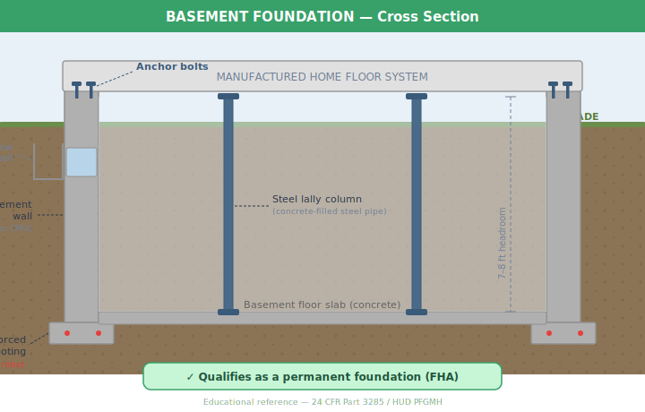

# Foundation Types — Visual Reference Guide

A scrollable visual reference for the four HUD-recognized manufactured home foundation types, plus a decision flowchart for field identification. All diagrams are cross-section views showing the key structural components an inspector or homeowner should recognize.

> **Regulation basis:** 24 CFR Part 3285 (Model Manufactured Home Installation Standards) and the HUD Permanent Foundations Guide for Manufactured Housing (HUD-007487).

---

## How to Identify the Foundation Type

Before diving into individual types, use this flowchart to determine which foundation you're looking at. Start from the outside of the home and work through the yes/no questions.

The most common field mistake is confusing **masonry skirting** (decorative, non-structural) with a **structural perimeter wall**. The key difference: a structural wall has anchor bolts connecting it to the home's frame. If you can push on the enclosure and it flexes, or there are no visible bolts at the top, it's skirting — not a foundation wall.

---

## 1. Pier and Anchor System

The most common support system for manufactured homes. The home's steel chassis I-beams rest on stacked CMU (concrete masonry unit) block piers, with diagonal steel straps running to auger-type ground anchors for lateral resistance.

**What to look for from outside:** A visible gap between the bottom of the home and the ground, typically enclosed by non-structural vinyl or metal skirting. Skirting usually has a vent opening. The home appears to "float" above grade.

**What to look for underneath:** Stacked concrete blocks on flat concrete pads, steel I-beams running the length of the home, diagonal steel straps connecting the frame to anchors driven into the soil, and a vapor barrier on the ground.

**FHA permanent foundation status:** Depends on the anchorage and perimeter enclosure. Pier and block systems CAN qualify when they have rated anchorage (not screw-in only), reinforced concrete footings, and a continuous perimeter enclosure. Screw-in anchors alone do not meet permanent foundation requirements.

---

## 2. Crawl Space Foundation

The home sits on a continuous structural perimeter wall (concrete or CMU) with reinforced footings below the frost line. The home is mechanically bolted to the wall through a sill plate. Interior support posts carry loads from the chassis I-beams down to individual footings.

**What to look for from outside:** No visible gap — the perimeter wall runs continuously from grade to the underside of the home. The wall is concrete or masonry block, not vinyl skirting. You may see small rectangular vent openings in the wall.

**What to look for underneath:** 18 inches to 3 feet of clearance beneath the home. A continuous perimeter wall on all sides. Anchor bolts visible at the top of the wall passing through a wood sill plate. Interior wood or steel posts on concrete pad footings. A vapor barrier covering the ground.

**FHA permanent foundation status:** Generally qualifies. The combination of a structural perimeter wall, anchor bolts, and reinforced footings below frost depth meets the HUD permanent foundation definition.

---

## 3. Slab-on-Grade Foundation

The home sits directly on a poured concrete slab with no accessible space underneath. Anchor bolts are embedded in the concrete and mechanically connect the home's frame to the slab. The slab has turned-down footings at the perimeter that extend below grade.

**What to look for from outside:** The home sits flush with or very close to grade level. No gap, no perimeter wall visible above ground. You can see the edge of the concrete slab at the perimeter. The ground slopes away from the slab at roughly ½ inch per foot.

**What to look for underneath:** You can't — there is no accessible underside. Inspection is limited to the slab perimeter and edges. This makes construction documentation especially valuable for slab-on-grade foundations.

**FHA permanent foundation status:** Generally qualifies. The monolithic slab with turned-down footings and embedded anchor bolts is one of the most straightforward permanent foundation configurations.

---

## 4. Basement Foundation

A full-height below-grade space with concrete or CMU walls extending from the footing to the home's floor system. The home is bolted to the top of the basement walls. Interior steel lally columns (concrete-filled steel pipes) provide intermediate support. A poured concrete floor slab covers the basement floor.

**What to look for from outside:** The home appears to sit at grade level, but one or more sides may reveal a walkout or window wells indicating a full-height space below. The foundation walls are heavy — poured concrete or stacked CMU block.

**What to look for underneath:** 7 to 8 feet of headroom in the basement space. Concrete or CMU walls on all sides. Steel lally columns supporting the floor system from below. A poured concrete floor slab. Anchor bolts at the top of the walls connecting to the home's frame.

**FHA permanent foundation status:** Generally qualifies. Basements inherently meet permanent foundation criteria with their full-height structural walls, reinforced footings, and mechanical connection to the home.

---

## Quick Comparison

| Feature | Pier & Anchor | Crawl Space | Slab-on-Grade | Basement |
|---|---|---|---|---|
| Visible gap below home | Yes | No | No | No |
| Perimeter enclosure | Skirting (non-structural) | Structural wall | Slab edge | Structural wall |
| Accessible underside | Yes | Yes (limited) | No | Yes (full height) |
| Typical clearance | 24–48 in. | 18 in. – 3 ft | None | 7–8 ft |
| FHA permanent status | Depends on anchorage | Generally qualifies | Generally qualifies | Generally qualifies |
| Key inspection focus | Anchor type, pier condition, strap connections | Anchor bolts, wall integrity, frost depth | Slab edges, documentation | Wall condition, columns, moisture |

---

## Related Resources

- [Foundation Systems Guide](foundation-systems-guide.md) — Full technical details on each type
- [Field Identification Guide](foundation-type-identification.md) — Step-by-step walkthrough for identifying foundation types
- [Inspector Verification Guide](inspector-verification-guide.md) — Pass/fail checklists by type
- [Glossary](glossary.md) — Definitions of HUD foundation terms

---

*Educational reference — 24 CFR Part 3285 / HUD Permanent Foundations Guide for Manufactured Housing (HUD-007487)*
